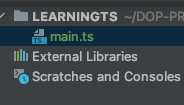

[Index](index.md) | [Başlangıç](../README.md)
___
# Çalışma Alanı ve İlk Uygulama

Bu TypeScript eğitiminde, kaynak kodumuz için bir çalışma alanı oluşturmayı ve ilk uygulamamızı yazmayı öğreniyoruz.

Ayrıca TypeScript betiğini bir Javascript scriptte nasıl derleyeceğimizi ve ardından bunu terminalde nasıl çalıştıracağımızı da açıklıyoruz.

**İşte bu derste öğreneceklerin içindekiler tablosu:**

* Geliştirme Çalışma Alanı

* İlk uygulama: Hello World 

* TypeScript komut dosyası nasıl derlenir 

* Derlenmiş bir Javascript komut dosyası nasıl çalıştırılır 

* Özet: Hatırlanması gereken noktalar

**Geliştirme Çalışma Alanı**

İlk TypeScript uygulamamızı yazmadan önce bir çalışma alanı oluşturmamız gerekiyor. Çalışma alanı, sistemimizde herhangi bir yerde, TypeScript uygulamamızı oluşturan tüm dosyaları içeren bir klasördür.

Masaüstünde "LearningTS" adlı tek bir klasör oluşturun. 

Klasörü IDE'nizde proje / çalışma alanı olarak açın. 

_Visual Studio Code'da çalışıyorsanız, _**_Dosya\> Klasörü Aç'_**_a gidin, Masaüstündeki "LearningTS" klasörüne gidin ve _**_Klasörü Aç'_**_ı seçin._

**İlk uygulama: Hello World**

Artık bir çalışma alanımız olduğuna göre, TypeScript uygulamamızın kodunu içerecek kaynak dosyaları oluşturabiliriz.

IDE'nizin içinde "main.ts" adlı yeni bir dosya oluşturun.

Visual Studio Code'da çalışıyorsanız, Dosya Gezgini'nde "_LEARNINGTS_" in yanındaki **Yeni Dosya **düğmesini tıklayın.



Aşağıdaki kodu kopyalayıp yapıştırın ve dosyayı kaydedin.  

```typescript,editable

function logger() {

  console.log("Hello, World!");
}

logger();

```

**TypeScript komut dosyası nasıl derlenir?**

Artık bir kaynak kodumuz olduğuna göre, kodumuzu sistemde çalışabilecek bir şeye derleyebiliriz.

**Visual Studio Code kullanıyorsanız:**

VSC, TypeScript komut dosyalarımızı derlemek için kullanabileceğimiz entegre bir terminale sahiptir.

Terminal\> Yeni Terminal'e gidin. Terminal penceresi, kod düzenleyicinin altına genişleyecek ve otomatik olarak çalışmakta olduğunuz geçerli klasöre yönlendirilecektir.

Uygulamayı derlemek ve çalıştırmak için tsc komutunu, ardından dosya adı ve .ts uzantısını kullanıyoruz.

```shell, editable
 tsc main.ts
```
  
Bu, TypeScript komut dosyasını bir Javascript betiğinde derleyecektir. Proje Gezgini'nde "main.js" adlı yeni bir dosya görmelisiniz.

**Visual Studio Code kullanmıyorsanız:**

Windows'ta, Başlat / Windows düğmesine tıklayın, **cmd** yazın ve Komut İstemi'ni açmak için Enter tuşuna basın.

Mac OS X'te, **Uygulamalar**\> **İzlenceler'i** açın ve **Terminal'**e çift tıklayın.

Linux'ta (Ubuntu / Mint), terminali açmak için Ctrl + Alt + T tuşlarına basın.

Masaüstünüzdeki 'LearningTS' klasörüne gidin ve içine **cd** yapın.

Örnek:

```shell, editable
  cd C:\Users\YOURUSERNAME\Desktop\LearningGo
```
  
Uygulamayı derlemek ve çalıştırmak için **tsc** komutunu, ardından dosya adı ve .ts uzantısını kullanıyoruz.  

```shell, editable
   node main.js
```
  
  
Bu, TypeScript komut dosyasını bir Javascript betiğinde derleyecektir. Proje Gezgini'nde "main.js" adlı yeni bir dosya görmelisiniz.

**Derlenmiş bir Javascript komut dosyası nasıl çalıştırılır?**

TypeScript'i doğrudan tarayıcıda çalıştıramayız. TypeScript olandan oluşturulan Javascript dosyasını çalıştırmalıyız.

Terminal'de, oluşturulan Javascript dosyasını çalıştırmak için aşağıdaki komutu yazın.

"Hello, World!" kelimelerini görmelisiniz.

_Oluşturulan .js dosyası, genellikle orijinal .ts dosyasıyla aynı ada sahip olacaktır_.

Bu iki aşamalı süreç ilk başta geliştiriciler için can sıkıcı olabilir, ancak buna oldukça çabuk alışırsınız.

**Özet: Hatırlanması gereken noktalar**

İlk TypeScript uygulamanızı yazdığınız için tebrikler. Elbette çok heyecan verici değil ama TypeScript'in gerçekten ne kadar kolay olduğunu gösteriyor.

___
[Index](index.md) | [Başlangıç](../README.md)

